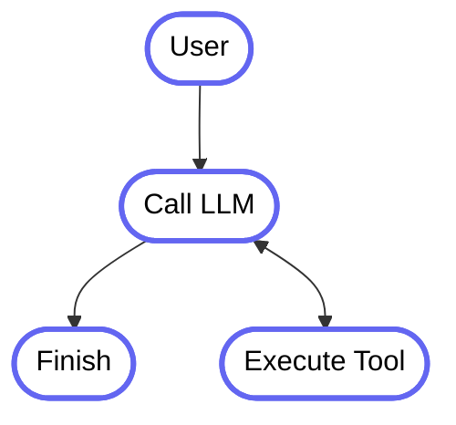

# Lambda World

## Crafting Elegant DSLs in Kotlin

<br>

- Simon Vergauwen
- Alejandro Serrano

---
kodee:
  variant: greeting
  size: large
  position: featured
---

# Crafting Elegant DSLs in Kotlin

- Introduction
- DSL Design principles
- Extending DSLs

---
kodee:
  variant: greeting
  size: small
  position: corner
---

# What is Kotlin?

- Kotlin is a statically typed programming language
- Multiplatform: JVM (& Android), JS/WASM, Native (iOS, Mac, Linux, Windows)
- Modern language features:
    - Coroutines
    - Powerful type system
        - Null safety
        - Smart casting
        - Data-flow-based constraint system

---
kodee:
  variant: greeting
  size: small
  position: corner
---

# Typesafe DSL in Kotlin: Routing

````md magic-move
```kotlin
html {
}
```

```kotlin
html {
    body {
    }
}
```

```kotlin
html {
    body {
        a("https://kotlinlang.org") {
            target = ATarget.blank
            +"Main site"
        }
    }
}
```
````

---
kodee:
  variant: greeting
  size: small
  position: corner
---

# Lambda

````md magic-move
```kotlin
val trim: (String) -> String = { it.trim() }
```

```kotlin
val trim: (String) -> String = { it.trim() }

val trim2: (String) -> String = String::trim
```

```kotlin{5}
val trim: (String) -> String = { it.trim() }

val trim2: (String) -> String = String::trim

val sum: (Int, Int) -> Int = { a, b -> a + b }
```
````

---
kodee:
  variant: greeting
  size: small
  position: corner
---

# Lambda as parameter

````md magic-move
```kotlin
fun <A> env(key: String, transform: (String) -> A): A? = TODO()
```

```kotlin
fun <A> env(key: String, transform: (String) -> A): A? =
    System.getenv(key)
```

```kotlin
fun <A> env(key: String, transform: (String) -> A): A? =
    System.getenv(key)?.let(transform)
```

```kotlin
fun <A> env(key: String, transform: (String) -> A): A? =
    System.getenv(key)?.let(transform)

val maxConcurrencyCount = env("MAX_CONCURRENCY_COUNT") { it.toIntOrNull() }
```

```kotlin
fun <A> env(key: String, transform: (String) -> A): A? =
    System.getenv(key)?.let(transform)

val maxConcurrencyCount = env("MAX_CONCURRENCY_COUNT") { it.toIntOrNull() } ?: 64
```

```kotlin
fun <A> env(key: String, transform: (String) -> A): A? =
    System.getenv(key)?.let(transform)

val maxConcurrencyCount = env("MAX_CONCURRENCY_COUNT") { it.toIntOrNull() } ?: 64
val maxConcurrencyCount2 = env("MAX_CONCURRENCY_COUNT", String::toIntOrNull) ?: 64
```
````

---
kodee:
  variant: greeting
  size: small
  position: corner
---

# Lambdas as return type

````md magic-move
```kotlin
fun plusConstant(constant: Int): (Int) -> Int = { it + constant }
```

```kotlin
fun plusConstant(constant: Int): (Int) -> Int = { it + constant }

val add10: (Int) -> Int = plusConstant(10)
```
````

---
kodee:
  variant: greeting
  size: small
  position: corner
---

# Extension functions

````md magic-move
```kotlin
fun String.isNotEmpty(): Boolean = TODO()
```

```kotlin
fun String.isNotEmpty(): Boolean {
    val x: String = this
    TODO()
}
```

```kotlin
fun String.isNotEmpty(): Boolean {
    val x: String = this
    return x.size > 0
}
```

```kotlin
fun String.isNotEmpty(): Boolean {
    return this.size > 0
}
```

```kotlin
fun String.isNotEmpty(): Boolean = size > 0
```

```kotlin
fun String.isNotEmpty(): Boolean = size > 0

"".isNotEmpty() // false
"not-empty".isNotEmpty() // true
```
````

<div v-click="6">
<ul>
<li><code lang="kotlin">isNotEmpty</code> requires an explicit import</li>
<li><code lang="kotlin">FileNameKt.isNotEmpty(string)</code> from Java</li>
</ul>
</div>

---
kodee:
  variant: greeting
  size: small
  position: corner
---

# Lambda with Receiver

````md magic-move
```kotlin
class HtmlBuilder {
    fun body(block: BodyBuilder.() -> Unit) = TODO()       
}
```

```kotlin
class HtmlBuilder {
    fun body(block: BodyBuilder.() -> Unit) = TODO()       
}

fun html(block: HtmlBuilder.() -> Unit): String = TODO()
```

```kotlin
class HtmlBuilder {
    fun body(block: BodyBuilder.() -> Unit) = TODO()       
}

fun html(block: HtmlBuilder.() -> Unit): String = TODO()

val index = html { // HtmlBuilder.() -> Unit
    val builder: HtmlBuilder = this
}
```

```kotlin
class HtmlBuilder {
    fun body(block: BodyBuilder.() -> Unit) = TODO()       
}

fun html(block: HtmlBuilder.() -> Unit): String = TODO()

val index = html { // HtmlBuilder.() -> Unit
    val builder: HtmlBuilder = this
    builder.body {
    
    }
}
```

```kotlin
class HtmlBuilder {
    fun body(block: BodyBuilder.() -> Unit) = TODO()       
}

fun html(block: HtmlBuilder.() -> Unit): String = TODO()

val index = html { // HtmlBuilder.() -> Unit
    this.body {
    
    }
}
```

```kotlin
class HtmlBuilder {
    fun body(block: BodyBuilder.() -> Unit) = TODO()       
}

fun html(block: HtmlBuilder.() -> Unit): String = TODO()

val index = html { // HtmlBuilder.() -> Unit
    body {
    
    }
}
```

```kotlin
class HtmlBuilder(private val buffer: StringBuilder) {
    fun body(block: BodyBuilder.() -> Unit) = TODO()
}

fun html(block: HtmlBuilder.() -> Unit): String = TODO()

val index = html { // HtmlBuilder.() -> Unit
    body {
        // ...   
    }
}
```

```kotlin
class HtmlBuilder(private val buffer: StringBuilder) {
    fun body(block: BodyBuilder.() -> Unit) {
        buffer.append("<body>")
        BodyBuilder(buffer).block()
        buffer.append("</body>")
    }
}

fun html(block: HtmlBuilder.() -> Unit): String = TODO()

val index = html { // HtmlBuilder.() -> Unit
    body {
        // ...   
    }
}
```

```kotlin
class HtmlBuilder(private val buffer: StringBuilder) {
    fun body(block: BodyBuilder.() -> Unit) {
        buffer.append("<body>")
        BodyBuilder(buffer).block()
        buffer.append("</body>")
    }
    
    fun toHtmlString(): String = buffer.toString()
}

fun html(block: HtmlBuilder.() -> Unit): String = TODO()

val index = html { // HtmlBuilder.() -> Unit
    body {
        // ...   
    }
}
```

```kotlin
class HtmlBuilder(private val buffer: StringBuilder) {
    fun body(block: BodyBuilder.() -> Unit) {
        buffer.append("<body>")
        BodyBuilder(buffer).block()
        buffer.append("</body>")
    }
    
    fun toHtmlString(): String = buffer.toString()
}

fun html(block: HtmlBuilder.() -> Unit): String = 
    HtmlBuilder().apply(block()).toHtmlString()

val index = html { // HtmlBuilder.() -> Unit
    body {
        // ...   
    }
}
```
````

---
kodee:
  variant: greeting
  size: small
  position: corner
---

# Std compositional fun

````md magic-move
```kotlin
fun <T> T.let(block: (T) -> R): R = TODO()
```

```kotlin
fun <T> T.let(block: (T) -> R): R = TODO()

val x: String? = null
```

```kotlin
fun <T> T.let(block: (T) -> R): R = TODO()

val x: String? = null

x?.trim() // null
x?.let(String::trim) // null
```
````

---
kodee:
  variant: greeting
  size: small
  position: corner
---

# Std compositional fun

````md magic-move
```kotlin
fun <T> T.also(block: (T) -> Unit): T = TODO()
```

```kotlin
fun <T> T.also(block: (T) -> Unit): T = TODO()

"test".also(::println) // "test"
null.also(::println)   // "null"
null?.also(::println)  //
```
````

---
kodee:
  variant: greeting
  size: small
  position: corner
---

# Std compositional fun

<div v-click>
```java
HikariConfig config = new HikariConfig();
config.setUsername("username");
```
</div>
<div v-click="2">
```kotlin
fun <T> T.apply(block: T.() -> Unit): T = TODO()

HikariConfig().apply {
// setUsername("username")
<span v-mark.underline="3">username</span> = "username"
}

```
</div>

<div v-click="3">
<br>
<ul>
<li>Useful for achieving fluent syntax for types that do not allow it </li>
<li>Kotlin allows <code>username = </code> property syntax even though a Java setter <code>setUsername</code> is defined!</li>
</ul>
</div>

---
kodee:
  variant: greeting
  size: small
  position: corner
---

# Std compositional fun

````md magic-move
```kotlin
fun <T, R> T.run(block: T.() -> R): R = TODO()
```

```kotlin
fun <T, R> T.run(block: T.() -> R): R = TODO()

data class Person(val name: String, val age: Int)

val person = Person("John", 20)

println("Person(${person.name}, ${person.age})")
```

```kotlin
fun <T, R> T.run(block: T.() -> R): R = TODO()

data class Person(val name: String, val age: Int)

val person = Person("John", 20)

person.run {
    println("Person(${name}, ${age})")
}
```

````

---
kodee:
  variant: greeting
  size: small
  position: corner
---

# Build a typed DSL for prompting
## Kotlin Notebooks

---
kodee:
  variant: greeting
  size: small
  position: corner
---

# Build a typed DSL for prompting
## Exercise 1 (10min)

- Create a DSL receiver type (i.e. `class PromptBuilder`)
    - Create _at least a single_ function to `append` text to the prompt
- Create a DSL function (i.e. `prompt`) which returns the prompt string

---
kodee:
  variant: greeting
  size: small
  position: corner
---

# Build a typed DSL for prompting
## Exercise 2 (10min)

- Extend the `PromptBuilder` dsl with a `markdown` DSL.
    - `fun PromptBuilder.markdown(block: MarkdownBuilder.() -> Unit)`
    - Create `header`, `text` functions to build the markdown string
    - Create a nested `fun MarkdownBuilder.items(block: ItemsBuilder.() -> Unit)` function to build the items list

---
kodee:
  variant: greeting
  size: small
  position: corner
---

# Extending DSLs with your own domain

- DSLs are everywhere in Kotlin!
- Being able to fit your domain into existing DSLs is a great way to reuse existing code

---
kodee:
  variant: greeting
  size: small
  position: corner
---

# Domain

```kotlin
data class Author(val id: Long, val handle: String)

data class Content(
    val id: Long,
    val content: String,
    val author: Author,
    val createdAt: Instant
)
```

---
kodee:
  variant: greeting
  size: small
  position: corner
---

# Integrating Domain with PromptBuilder

```kotlin
val content = Content(1, "Hello World!", Author(1, "Alice"), Clock.System.now())

prompt {
    +content
}
```

---
kodee:
  variant: greeting
  size: small
  position: corner
---

# Integrating Domain with PromptBuilder

```kotlin
operator fun <span v-mark.underline>Content</span>.unaryPlus(): Unit
```

---
kodee:
  variant: greeting
  size: small
  position: corner
---

# Context Parameters

````md magic-move
```kotlin
context(builder: PromptBuilder)
operator fun Content.unaryPlus(): Unit
```

```kotlin
context(builder: PromptBuilder)
operator fun Content.unaryPlus(): Unit =
    builder.markdown {
    } 
```

```kotlin
context(builder: PromptBuilder)
operator fun Content.unaryPlus(): Unit =
    builder.markdown {
        header(1, content.title)
        header(3, "Author: ${content.author.handle}")
        text(content.content)
    }
```
````

---
kodee:
  variant: greeting
  size: small
  position: corner
---

# Context Parameters

## Kotlin

````md magic-move
```kotlin
context(builder: PromptBuilder)
operator fun Content.unaryPlus(): Unit = TODO()
```

```kotlin
context(builder: PromptBuilder)
operator fun Content.unaryPlus(): Unit = TODO()

val builder = PromptBuilderImpl()

context(builder) { // context(PromptBuilder) () -> A
    +Content(...)
}
```

```kotlin
context(builder: PromptBuilder)
operator fun Content.unaryPlus(): Unit = TODO()

prompt { // context(PromptBuilder) () -> A
    +Content(...)
}
```
````

<div v-click="3">
<ul>
<li><code lang="kotlin">PromptBuilder.() -> A</code> and <code lang="kotlin">context(PromptBuilder) () -> A</code> can be used interchangeably</li>
<li><code lang="kotlin">prompt { }</code> enforces scope. I.e. calculate final result, react on exception, etc.</li>
</ul>
</div>

---
kodee:
  variant: greeting
  size: small
  position: corner
---

# Exercise 3 (10min)

- Integrate `Content` & `Author` into `PromptBuilder` with custom formatting
- Create a new domain i.e., Content + comments, and integrate it into `PromptBuilder`
- Create different variants using `PromptBuilder` & `MarkdownBuilder`
- Create a function that writes `Content` as xml within `PromptBuilder` directly
  - Consider building a base DSL or extending PromptBuilder directly with behavior

---
kodee:
  variant: greeting
  size: small
  position: corner
---

# Going beyond types

- DSLs can be incorrectly nested
- Leads to unexpected behavior

---
kodee:
  variant: greeting
  size: small
  position: corner
---

# Going beyond types

```kotlin
html {
    body {
        body {} // should be forbidden
    }
    // ...
}
```

---
kodee:
  variant: greeting
  size: small
  position: corner
---

# Scope Control

```kotlin
@DslMarker
annotation class HtmlTagMarker
```

- `@DslMarker` enforces that implicit receivers marked with the same annotation are not allowed to be used in the DSL

---
kodee:
  variant: greeting
  size: small
  position: corner
---

# Scope Control

````md magic-move
```kotlin
@DslMarker
annotation class HtmlTagMarker

@HtmlTagMarker class HtmlBuilder {
  fun body(block: BodyBuilder.() -> Unit)
}
@HtmlTagMarker class BodyBuilder {
    fun p(text: String)
}
```

```kotlin
@DslMarker
annotation class HtmlTagMarker

@HtmlTagMarker class HtmlBuilder {
  fun body(block: BodyBuilder.() -> Unit)
}
@HtmlTagMarker class BodyBuilder {
    fun p(text: String)
}

val index = html { // HtmlBuilder.() -> Unit
  // <-- HtmlBuilder is explicit receiver
}
```

```kotlin
@DslMarker
annotation class HtmlTagMarker

@HtmlTagMarker class HtmlBuilder {
  fun body(block: BodyBuilder.() -> Unit)
}
@HtmlTagMarker class BodyBuilder {
    fun p(text: String)
}

val index = html { // HtmlBuilder.() -> Unit
  // <-- HtmlBuilder is explicit receiver
  body { // BodyBuilder.() -> Unit
    // <-- BodyBuilder is explicit receiver
    // <-- HtmlBuilder is implicit receiver 
  }
}
```

```kotlin
@DslMarker
annotation class HtmlTagMarker

@HtmlTagMarker class HtmlBuilder {
  fun body(block: BodyBuilder.() -> Unit)
}
@HtmlTagMarker class BodyBuilder {
    fun p(text: String)
}

val index = html { // HtmlBuilder.() -> Unit
  // <-- HtmlBuilder is explicit receiver
  body { // BodyBuilder.() -> Unit
    // <-- BodyBuilder is explicit receiver
    // <-- HtmlBuilder is implicit receiver 
    this@html.body { } // explicit access this allowed
  }
}
```
````

---
kodee:
  variant: greeting
  size: small
  position: corner
---

# Exercise 4 (10min)

- Create a `@DslMarker` and make sure that following code doesn't compile
- Find two different ways of achieving this (inheritance).

```kotlin
prompt {
    markdown {
        markdown { } // not allowed implicit receiver
    }
}
```

---
kodee:
  variant: greeting
  size: small
  position: corner
---

# What else?

## Koog DSL

```kotlin
strategy("single_run") {
    val nodeCallLLM by nodeLLMRequest()
    val nodeExecuteTool by nodeExecuteTool()
    val nodeSendToolResult by nodeLLMSendToolResult()

    edge(nodeStart forwardTo nodeCallLLM)
    edge(nodeCallLLM forwardTo nodeExecuteTool onToolCall { true })
    edge(nodeCallLLM forwardTo nodeFinish onAssistantMessage { true })
    edge(nodeExecuteTool forwardTo nodeSendToolResult)
    edge(nodeSendToolResult forwardTo nodeFinish onAssistantMessage { true })
    edge(nodeSendToolResult forwardTo nodeExecuteTool onToolCall { true })
}
```

---
layout: two-cols-header
---

## Koog DSL

::left::



::right::

```kotlin
strategy("single_run") {
    val nodeCallLLM by nodeLLMRequest()
    val nodeExecuteTool by nodeExecuteTool()
    val nodeSendToolResult by nodeLLMSendToolResult()

    edge(nodeStart forwardTo nodeCallLLM)
    edge(nodeCallLLM forwardTo nodeExecuteTool onToolCall { true })
    edge(nodeCallLLM forwardTo nodeFinish onAssistantMessage { true })
    edge(nodeExecuteTool forwardTo nodeSendToolResult)
    edge(nodeSendToolResult forwardTo nodeFinish onAssistantMessage { true })
    edge(nodeSendToolResult forwardTo nodeExecuteTool onToolCall { true })
}
```

---
kodee:
  variant: greeting
  size: small
  position: corner
---

# Delegation

```kotlin
val nodeCallLLM <span v-mark.underline> by </span> nodeLLMRequest()
```

<div v-click="2">
```kotlin
public fun interface ReadOnlyProperty<in T, out V> {
    operator fun getValue(thisRef: T, property: KProperty<*>): V
}
```
</div>
<div v-click="3">
```kotlin
class AIAgentNodeDelegate<In, Out>(...) : ReadOnlyProperty<Any?, Node<In, Out>> {
    operator fun getValue(thisRef: T, property: KProperty<*>): V
}
```
</div>

---
kodee:
  variant: greeting
  size: small
  position: corner
---

# Delegation

```kotlin
val nodeCallLLM by nodeLLMRequest()
```

```kotlin
public fun interface ReadOnlyProperty<in T, out V> {
    operator fun getValue(thisRef: T, property: KProperty<*>): V
}
```

```kotlin
class AIAgentNodeDelegate<In, Out>(...) {
    operator fun getValue(thisRef: T, property: KProperty<*>): V
}
```

---

# Delegation

````md magic-move
```kotlin
class LazyNamedValue<A>: ReadOnlyProperty<Any?, A> {
    override fun getValue(thisRef: Any?, property: KProperty<*>): A
}
```

```kotlin
class LazyNamedValue<A>(
    private val block: (name: String) -> A, 
    private var value: A? = null
): ReadOnlyProperty<Any?, A> {
    override fun getValue(thisRef: Any?, property: KProperty<*>): A
}
```

```kotlin
class LazyNamedValue<A>(
    private val block: (name: String) -> A, 
    private var value: A? = null
): ReadOnlyProperty<Any?, A> {
    override fun getValue(thisRef: Any?, property: KProperty<*>): A {
        if (value == null) {
            value = block(property.name)
        }
        return value!!
    }
}
```

```kotlin
class LazyNamedValue<A>(
    private val block: (name: String) -> A, 
    private var value: A? = null
) {
    operator fun getValue(thisRef: Any?, property: KProperty<*>): A {
        if (value == null) {
            value = block(property.name)
        }
        return value!!
    }
}
```
````

---

# Koog DSL

````md magic-move
```kotlin
val strategy = functionalStrategy<String, String> { input ->
}
```

```kotlin
val strategy = functionalStrategy<String, String> { input ->
    var responses = requestLLMM(input) 
    responses.filterIsInstance<Message.Assistant>.joinToString { it.content }
}
```

```kotlin
val strategy = functionalStrategy<String, String> { input ->
    var responses = requestLLMM(input)

    while (responses.containsToolCalls()) {
        val tools = extractToolCalls(responses)
    }
    
    responses.filterIsInstance<Message.Assistant>.joinToString { it.content }
}
```

```kotlin
val strategy = functionalStrategy<String, String> { input ->
    var responses = requestLLMM(input)

    while (responses.containsToolCalls()) {
        val tools = extractToolCalls(responses)
        if (latestTokenUsage() > 100500) {
            compressHistory()
        }
    }
    
    responses.filterIsInstance<Message.Assistant>.joinToString { it.content }
}
```

```kotlin
val strategy = functionalStrategy<String, String> { input ->
    var responses = requestLLMM(input)

    while (responses.containsToolCalls()) {
        val tools = extractToolCalls(responses)
        if (latestTokenUsage() > 100500) {
            compressHistory()
        }

        val results = executeMultipleTools(tools)
        responses = sendMultipleToolResults(results)
    }
    
    responses.filterIsInstance<Message.Assistant>.joinToString { it.content }
}
```
````

---

# Koog DSL

````md magic-move
```kotlin
val strategy = functionalStrategy<String, String> { input ->
 
}
```

```kotlin
val strategy = functionalStrategy<String, String> { input ->
    suspend tailrec fun loop(responses: List<Message.Response>) = TODO()
        
    loop(requestLLM(input))    
}
```

```kotlin
val strategy = functionalStrategy<String, String> { input ->
    suspend tailrec fun loop(responses: List<Message.Response>) =
      if(responses.containsToolCalls()) TODO() else TODO()

    loop(requestLLM(input))    
}
```

```kotlin
val strategy = functionalStrategy<String, String> { input ->
    suspend tailrec fun loop(responses: List<Message.Response>) =
      if(responses.containsToolCalls()) {
        TODO()
      } else {
        responses.filterIsInstance<Message.Assistant>.joinToString { it.content }
      }

    loop(requestLLM(input))    
}
```

```kotlin
val strategy = functionalStrategy<String, String> { input ->
    suspend tailrec fun loop(responses: List<Message.Response>) =
      if(responses.containsToolCalls()) {
        val tools = extractToolCalls(responses)
        if (latestTokenUsage() > 100500) compressHistory()
        val results = executeMultipleTools(tools)
        loop(sendMultipleToolResults(results))
      } else {
        responses.filterIsInstance<Message.Assistant>.joinToString { it.content }
      }

    loop(requestLLM(input))    
}
```
````

---

# Thank you!

- Questions?
